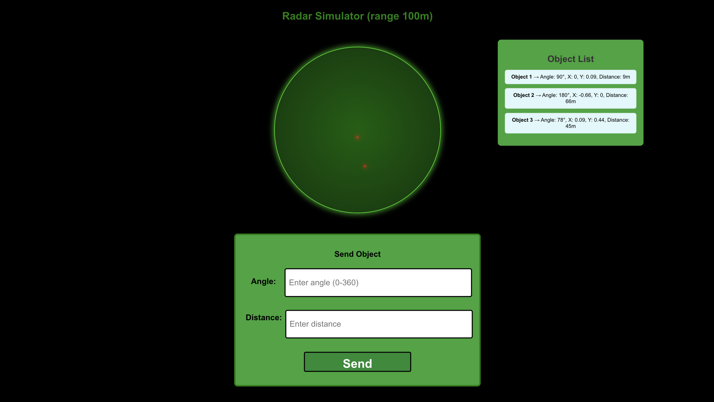

# Signal-Eye: Radar Signal Processing Visualizer

**Signal-Eye** is a radar signal processing visualizer built with **React** that simulates the appearance of detected targets based on distance and angle input. It displays how radar targets would look on a radar screen with a radius of 100 meters, giving users an interactive and educational experience in radar signal processing.

## Significance of the Application

Radar systems are integral to many fields, including **defense**, **aviation**, **weather monitoring**, and **robotics**. Radar signal processing is used to detect objects, measure distances, and calculate velocities, making it essential in navigation, surveillance, and even self-driving vehicles. Signal-Eye aims to offer an easy-to-use visualization tool for understanding how radar signals and detected objects are represented on a radar screen.

**Key Features:**

- **Interactive Radar Visualization**: Simulates the radar display based on input distance and angle.
- **Educational Tool**: Helps users visualize radar signal processing, including how distance and angle affect the radar output.
- **Simple Input**: Users input distance (meters) and angle (degrees) of objects, and the app generates corresponding radar points.
- **Real-Time Simulation**: Updates dynamically with each new input for instant feedback on radar detections.

## Technologies Used

- **Frontend**: React.js
- **Visualization**: HTML5 Canvas, React State Management
- **Containerization**: Docker
- **Deployment**: Localhost (can be deployed to cloud platforms like AWS, Azure, or Heroku)

## Running the Application

To run the **Signal-Eye** application on your local machine, follow these steps:

### 1. Clone the Repository

If you haven’t already cloned the repository to your local machine, run the following command:

```bash
git clone <your-repository-url>
cd signal-eye
```

### 2. Docker Setup

Signal-Eye uses Docker to containerize the application, making it easy to deploy and run on any system with Docker installed.

#### Building the Docker Image

docker build -t signal-eye .

This command will build the Docker image and tag it as signal-eye.

#### Running the Application in Docker

docker run -p 80:80 signal-eye

This command runs the Docker container, maps port 80 on your local machine to port 80 on the container, and makes the application accessible in your browser.

### Accessing the Application

Once the container is running, open a browser and visit:

http://localhost

## How It Works

### Input Parameters:

- **Distance** (in meters): The range at which the target is detected.
- **Angle** (in degrees): The direction at which the target is located relative to the radar.

### Radar Simulation:

- The radar's **radius** is set to 100 meters, meaning all targets within this radius will be shown on the radar screen.
- As you input the distance and angle, the application calculates the target's position and updates the radar display.

### Radar Display:

- The target will appear as a point on the radar screen, and the radar will simulate a typical sweep motion (showing how it scans for objects).
- The radar system updates the displayed targets in real-time as new inputs are provided.

## Future Enhancements

- **Noise Simulation**: Simulate signal interference or errors to create more realistic radar conditions.
- **Multi-Target Tracking**: Handle multiple targets simultaneously and display them with different identifiers.
- **Doppler Effect Visualization**: Visualize how velocity can be detected based on the Doppler shift in the radar signal.
- **Radar Sweep Simulation**: Simulate a full radar sweep with animation to show how the radar scans its environment.

## License

This project is licensed under the MIT License - see the [LICENSE](LICENSE) file for details.


